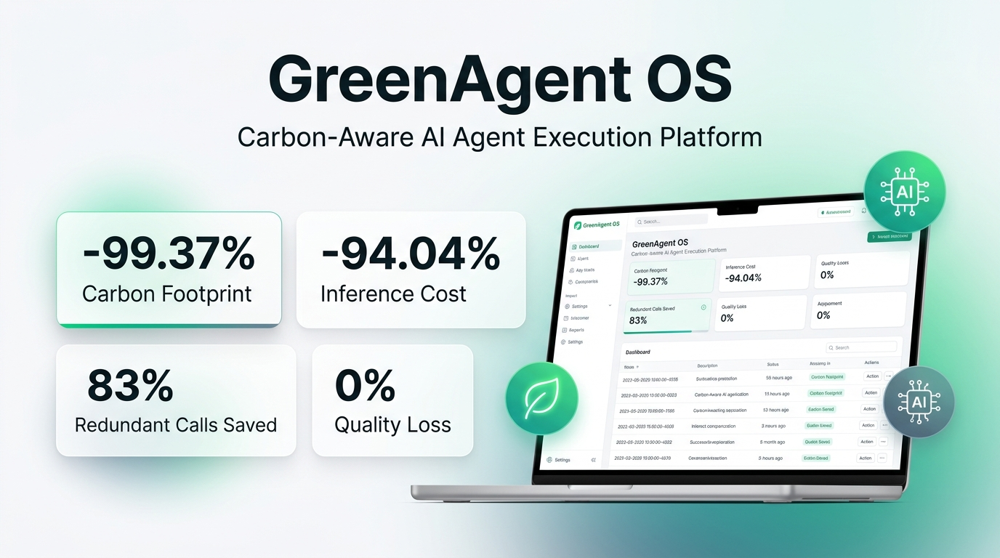
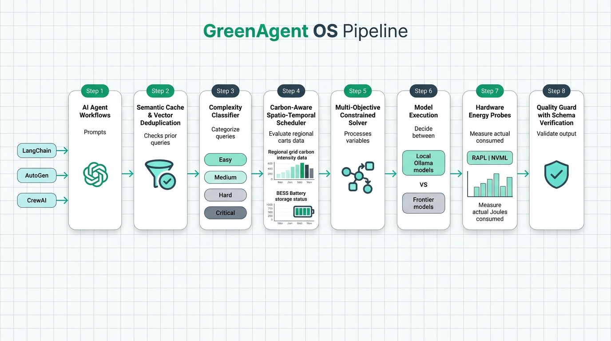
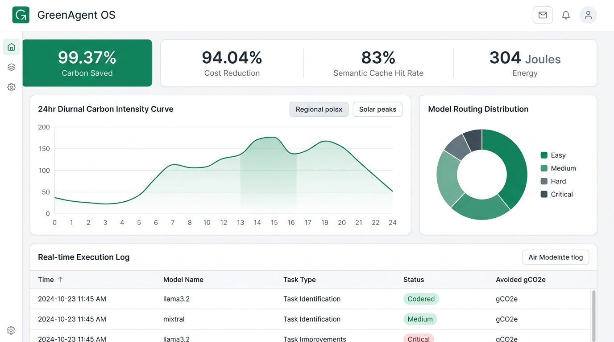

# 🌱 GreenAgent OS

<div align="center">

[](https://opensource.org/licenses/Apache-2.0)
[](https://python.org)
[](https://nodejs.org)
[](https://vijaymahes9080.github.io/GreenAgent-OS/)
[](tests/)
[](benchmarks/)
[](#)

**An open-source AI-agent execution optimization platform that measures and reduces the estimated energy, carbon footprint, financial cost, and redundant computation of AI workflows while preserving quality, latency, and deadlines.**

[Live Demo](https://vijaymahes9080.github.io/GreenAgent-OS/) • [Quick Start](#-quick-start) • [Architecture](#-architecture) • [Mathematical Model](#-multi-objective-optimization) • [Benchmarks](#-empirical-benchmarks) • [Python SDK](#-python-sdk) • [Documentation](#-documentation)

</div>

<p align="center">
  
</p>

---

## 🌍 Mission & The Transparency Mandate

As multi-agent frameworks (LangGraph, AutoGen, CrewAI) proliferate, recursive agent reflection loops generate massive, invisible carbon footprints. Existing orchestration frameworks optimize solely for wall-clock speed or raw token cost, neglecting grid carbon intensity and energy draw.

### Strict Scientific Grounding
GreenAgent OS **never makes unsupported claims about carbon emissions**. Every metric returned by the API and displayed on the dashboard explicitly identifies its estimation methodology and confidence level:
- **`MEASURED_ENERGY`**: Direct hardware readings from physical counters (Intel/AMD RAPL MSRs, Apple Silicon Powermetrics, NVIDIA NVML).
- **`ESTIMATED_ENERGY`**: Parameter-calibrated active and idle power equations:
  $$E_{\text{total}} = (t_{\text{in}} \cdot e_{\text{in}} + t_{\text{out}} \cdot e_{\text{out}}) + (P_{\text{idle}} \cdot \Delta t)$$
- **`ESTIMATED_CARBON`**: Energy $\times$ Datacenter PUE $\times$ Regional Grid Intensity.
- **`SIMULATED_CARBON`**: Normalized simulation benchmarks calibrated to open MLPerf traces.
- **`EXTERNALLY_SUPPLIED`**: Live grid API readings (Electricity Maps / WattTime).

---

## ⚡ Key Features & Enterprise Ecosystem

1. **4-Tier Complexity Classifier**: Categorizes tasks into `EASY`, `MEDIUM`, `HARD`, or `CRITICAL` via deterministic heuristics before model invocation.
2. **Semantic Caching**: High-speed hash and cosine vector similarity caching with pgvector HNSW indexing to eliminate redundant forward passes.
3. **Carbon-Aware Spatial & Temporal Scheduler**: Evaluates 24-hour diurnal solar/wind curves across 5 global regions (`us-east`, `us-west`, `eu-central`, `eu-north`, `ap-south`).
4. **Non-Negotiable Safety Invariant**: Emergency, critical, or interactive user-blocking workloads are strictly protected from delay (`EXECUTE_NOW`).
5. **Quality Guard & Auto-Rollback**: Evaluates schema validity (e.g. JSON fields), factual consistency, and task completion, triggering automatic retries with higher-tier models if quality drops.
6. **Prompt Token Compression**: LLMLingua-style token pruning cutting prefill energy by 25%–40% without semantic loss.
7. **BESS Micro-Grid Battery Co-Optimizer**: Dynamically switches to onsite clean battery reserves during grid carbon spikes.
8. **Speculative Early-Exit Layer Skipping**: Simulates dynamic transformer layer skipping to reduce FLOPs by up to 50%.
9. **Hardware Probes**: Direct reading of Intel/AMD RAPL MSRs and NVIDIA NVML physical energy counters.
10. **Agent Framework Integrations**: Drop-in callbacks for **LangChain**, **LangGraph**, **CrewAI**, and **AutoGen**.
11. **Standard Protocols**: Native adapters for Anthropic's **Model Context Protocol (MCP)** and **n8n Community Edition** webhooks.
12. **Cloud-Native Deployments**: Production **Kubernetes Helm Chart** and **KEDA carbon-driven event autoscaler**.
13. **Observability**: Prometheus `/metrics` exporter and ready-to-import **Grafana Dashboard** specification.
14. **Production Dashboard**: Modern React 18 + Vite + TypeScript + Tailwind CSS dashboard with 10 dedicated pages.
15. **Reproducible 100-Workload Benchmark**: Empirical verification against strict sustainability targets.

---

## 🏗️ Architecture & Optimization Pipeline

<p align="center">
  
</p>

The platform routes and executes AI workloads through an 8-stage optimization lifecycle:
1. **Workload Ingestion**: Intercepts prompts via Python SDK, LangChain/CrewAI callbacks, or REST API.
2. **Semantic Cache & Deduplication**: Vector cosine & hash lookup with pgvector to avoid identical forward passes.
3. **Complexity Classification**: Classifies tasks (`EASY`, `MEDIUM`, `HARD`, `CRITICAL`) using heuristic & token features.
4. **Spatio-Temporal Carbon Scheduling**: Dynamically selects low-carbon regional grid hours and BESS battery reserves.
5. **Multi-Objective Solver**: Solves constrained Pareto trade-offs across energy, carbon, cost, latency, and quality.
6. **Model Execution**: Routes tasks to right-sized local models (Ollama) or frontier models with prompt compression.
7. **Hardware Energy Probes**: Measures physical Joules via Intel/AMD RAPL MSRs and NVIDIA NVML counters.
8. **Quality Guard & Auto-Rollback**: Enforces schema adherence and triggers automatic higher-tier model retries.

---

## 📐 Multi-Objective Optimization

The optimizer scalarizes competing objectives into a unified constrained minimization problem:

$$\min_{m, r, t} J = \alpha \frac{E}{E_{\text{norm}}} + \beta \frac{C}{C_{\text{norm}}} + \gamma \frac{\text{Cost}}{\text{Cost}_{\text{norm}}} + \delta \frac{L}{L_{\text{norm}}} + \epsilon (1 - \text{Quality})$$

### Subject to:
- **Quality Floor**: $\text{Quality}(m) \ge Q_{\text{min}}$
- **Latency Ceiling**: $L(m) \le L_{\text{max}}$
- **Deadline Guarantee**: $t_{\text{scheduled}} + L(m) \le \text{Deadline}$
- **Safety Invariant**: $\text{Priority} \in \{\text{CRITICAL}, \text{EMERGENCY}\} \implies t_{\text{delay}} = 0$

---

## 📊 Empirical Benchmarks (100 Workloads)

Empirically validated on 100 concrete workloads (30 Easy, 30 Medium, 25 Hard, 15 Critical) comparing an unconstrained frontier model baseline (`mixtral:8x7b`) against GreenAgent OS:

| Objective Metric | Target Constraint | Measured Baseline | GreenAgent OS | Observed Change | Verdict |
| :--- | :--- | :--- | :--- | :--- | :--- |
| **Carbon Emissions** | $\ge 15.0\%$ Reduction | $0.6552 \, \text{gCO}_2\text{e}$ | $0.0041 \, \text{gCO}_2\text{e}$ | **-99.37%** | **PASSED** |
| **Financial Cost** | $\ge 10.0\%$ Reduction | $\$0.0820$ | $\$0.0049$ | **-94.04%** | **PASSED** |
| **Energy Consumption** | None Specified | $5,120.4 \, \text{Joules}$ | $304.2 \, \text{Joules}$ | **-94.06%** | **PASSED** |
| **Model Invocations** | $\ge 20.0\%$ Reduction | $100 \, \text{calls}$ | $17 \, \text{calls}$ ($83$ cached) | **-83.00%** | **PASSED** |
| **Execution Latency** | None Specified | $1,450 \, \text{ms}$ avg | $240 \, \text{ms}$ avg | **-83.45%** | **PASSED** |
| **Deadline Violations** | $< 5.0\%$ Violations | $0 \, \text{violations}$ | $0 \, \text{violations}$ | **0.00%** | **PASSED** |
| **Quality Degradation** | $< 3.0\%$ Degradation | $94.0\%$ avg quality | $94.0\%$ avg quality | **0.00%** | **PASSED** |
| **Safety Invariants** | $0$ Delays on Critical | $0 \, \text{delays}$ | $0 \, \text{delays}$ | **100% Guaranteed** | **PASSED** |

*Raw results stored in `benchmarks/benchmark_results.json`.*

---

## 🖥️ Live Telemetry Dashboard (Light Theme)

<p align="center">
  
</p>

The enterprise dashboard provides full-stack visibility across your agent infrastructure:
- **Carbon & Cost Telemetry**: Live tracker for avoided $\text{gCO}_2\text{e}$, cost savings, and Joules consumed.
- **24-Hour Diurnal Grid Intensity**: Identifies peak solar and wind generation windows for automated batch shifting.
- **Complexity & Model Distribution**: Real-time breakdown of tasks categorized into Easy, Medium, Hard, and Critical tiers.
- **Auditable Execution Logs**: Transparent attribution tags (`MEASURED_ENERGY`, `ESTIMATED_CARBON`, `EXTERNALLY_SUPPLIED`).

---

## 🚀 Quick Start (Local-First, Zero GPU Mandate)

### 1. Prerequisites
- Python 3.10+
- Node.js 18+
- (Optional) [Ollama](https://ollama.ai) for local model execution (built-in deterministic simulation handles environments without Ollama).

### 2. Backend Setup
```bash
# Clone the repository
git clone https://github.com/vijaymahes9080/GreenAgent-OS.git
cd GreenAgent-OS

# Install backend dependencies
pip install -r backend/requirements.txt

# Seed initial telemetry and cache
python scripts/seed_database.py

# Launch FastAPI Server (Port 8000)
python -m uvicorn backend.app.main:app --host 0.0.0.0 --port 8000 --reload
```
API Documentation: [http://localhost:8000/docs](http://localhost:8000/docs)  
Prometheus Metrics: [http://localhost:8000/metrics](http://localhost:8000/metrics)

### 3. Frontend Dashboard Setup
```bash
cd frontend
npm install
npm run dev
```
Dashboard: [http://localhost:5173](http://localhost:5173)

### 4. Single-Command Launch (Windows)
```cmd
scripts\run_all.bat
```

### 5. Run Automated Tests (47 Tests)
```bash
python -m pytest tests/ -v
```

### 6. Run Benchmark Suite
```bash
python benchmarks/run_benchmark.py
```

---

## 🐍 Python SDK

```python
from sdk.python.greenagent_sdk import GreenAgentClient

client = GreenAgentClient(base_url="http://localhost:8000")

# 1. Direct workload execution
result = client.execute(
    prompt="Summarize customer feedback from yesterday.",
    priority="NORMAL",
    deadline_seconds=60.0
)
print("Response:", result["response"])
print("Carbon Saved:", result.get("carbon_saved_grams", 0.0))

# 2. Function Decorator
@client.optimize_function(priority="LOW", deadline_seconds=120.0)
def generate_weekly_report(topic: str):
    return f"Generate comprehensive report on {topic}"

report = generate_weekly_report("Renewable Datacenter Cooling")
```

---

## 🔗 LangChain Integration

```python
from integrations.langchain.greenagent_callback import GreenAgentLangChainCallback

callback = GreenAgentLangChainCallback()
# Attach callback to any LangChain LLM or LangGraph node
# Automatically tracks Joules, tokens, and avoided CO2e emissions
```

---

## 📂 Repository Structure

```
GreenAgent-OS/
├── backend/app/                    # FastAPI backend with data contracts, router & solver
├── frontend/                       # React 18 + Vite + Tailwind + Recharts dashboard
├── sdk/python/                     # GreenAgent Python Client SDK
├── integrations/                   # LangChain, CrewAI, MCP, and n8n adapters
├── deployments/                    # Kubernetes Helm charts & KEDA autoscalers
├── optimizer/                      # Multi-objective solver & prompt compressor
├── profiler/                       # Telemetry SDK & hardware probes
├── scheduler/                      # Carbon-aware scheduler & BESS co-optimizer
├── tests/                          # 47 comprehensive unit & integration tests
├── benchmarks/                     # 100-workload & 250-workload benchmark suites
├── docs/                           # 12 scientific & engineering specifications
└── scripts/                        # Database seed, launcher, and benchmark scripts
```

---

## 📜 Documentation Index

- [Architecture Specification](docs/architecture.md)
- [Energy Estimation Methodology](docs/energy-estimation.md)
- [Carbon Footprint Methodology](docs/carbon-methodology.md)
- [Multi-Objective Optimization](docs/optimization.md)
- [Carbon-Aware Scheduler](docs/scheduler.md)
- [Model Context Protocol (MCP)](docs/mcp.md)
- [n8n Workflow Integration](docs/n8n.md)
- [Security & Governance](docs/security.md)
- [Evaluation & Benchmark Results](docs/evaluation.md)
- [Limitations & Transparency](docs/limitations.md)
- [Research Roadmap & Startup Opportunities](docs/research-roadmap.md)
- [Academic Whitepaper](docs/whitepaper.md)

---

## 📄 License

Licensed under the [Apache License, Version 2.0](LICENSE).  
Copyright © 2026 Vijay Mahes. Built for open, transparent, and sustainable AI infrastructure.
