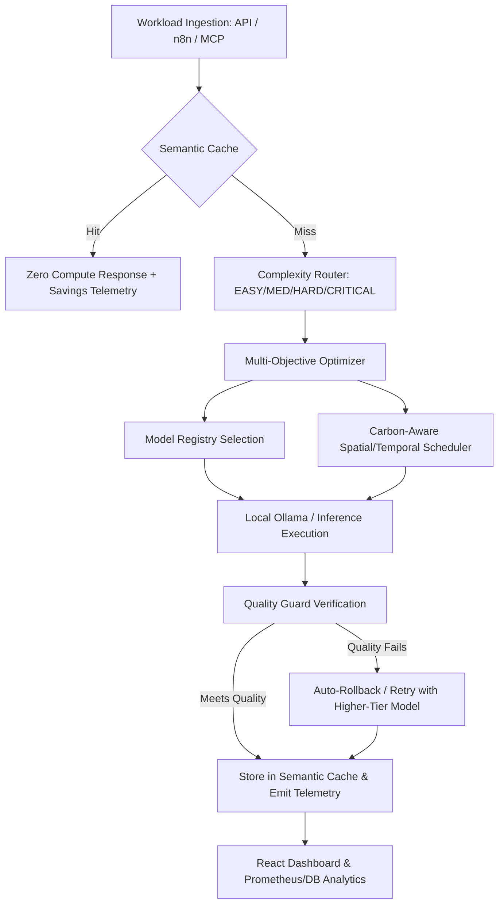

# GreenAgent OS — Architecture Specification

## Overview

GreenAgent OS is an open-source AI infrastructure platform designed to profile, route, cache, and schedule agentic workflows with transparent energy and carbon accounting. It addresses the growing carbon footprint of foundation models by introducing multi-objective optimization that balances environmental impact, financial cost, execution latency, and quality constraints.

## Core Subsystems

### 1. Data Contract Layer
Strict Pydantic v2 schemas enforcing timestamps, versioning, unique UUIDs, estimation methods (`MEASURED_ENERGY`, `ESTIMATED_ENERGY`, `ESTIMATED_CARBON`, `SIMULATED_CARBON`), and confidence intervals.

### 2. Telemetry Profiler & Energy Engine
Collects granular runtime counters: prompt/completion tokens, latency, retries, tool calls, cache status, and hardware counter data (RAPL / NVML / PDU).
- **Physical Counter Mode**: Integrates directly with OS MSRs.
- **Parametric Mode**: $E = t_{in} \cdot e_{in} + t_{out} \cdot e_{out} + P_{idle} \cdot \Delta t$.
- **Simulated Mode**: Calibrated against MLPerf baseline curves.

### 3. Model Registry
Maintains catalog of models with provider, capability benchmark score (0-1), latency estimate, cost, and energy per token. Supports deterministic selection based on complexity tiers and quality constraints.

### 4. Semantic Cache
Exact SHA-256 + cosine vector similarity caching. Guarantees that emergency, safety-sensitive, or volatile dynamic queries bypass caching to guarantee fresh reasoning.

### 5. Task Complexity Router
Deterministic multi-signal classifier assessing context size, reasoning keywords, output schema, tools required, and failure history to assign tasks to `EASY`, `MEDIUM`, `HARD`, or `CRITICAL`.

### 6. Carbon-Aware Scheduler
Schedules AI workflows through spatial shifting (routing to regions with hydro/clean grids like `eu-north` or `us-west`) or temporal shifting (postponing flexible batch jobs to daytime solar valleys).
- **Hard Safety Invariant**: Critical, emergency, or user-blocking workloads are strictly `EXECUTE_NOW`.

### 7. Multi-Objective Optimizer
Minimizes the scalarized loss function:
$$J = \alpha \cdot \frac{E}{E_{norm}} + \beta \cdot \frac{C}{C_{norm}} + \gamma \cdot \frac{\text{Cost}}{\text{Cost}_{norm}} + \delta \cdot \frac{L}{L_{norm}} + \epsilon \cdot (1 - Q)$$
Subject to:
$$Q \ge Q_{min}, \quad L \le L_{max}, \quad t_{sched} \le \text{Deadline}, \quad \text{Model.Available} == \text{True}$$

### 8. Quality Guard
Post-execution evaluation checking task completion, schema validity (e.g. JSON fields), tool-call success, and refusal heuristics. Rejects degradations and triggers fallback retry.

### 9. Integrations (MCP & n8n)
- **MCP Adapter**: Exposes audited tool catalog with permission verification, latency measurement, and failure tracking.
- **n8n Webhook**: Idempotent, HMAC-SHA256 signed webhook endpoint with automatic retry handling.
